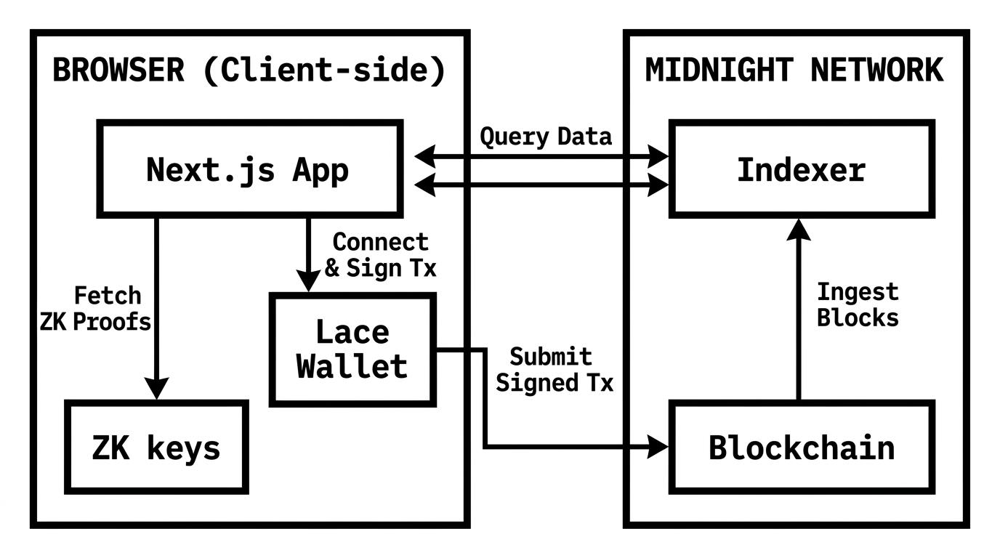
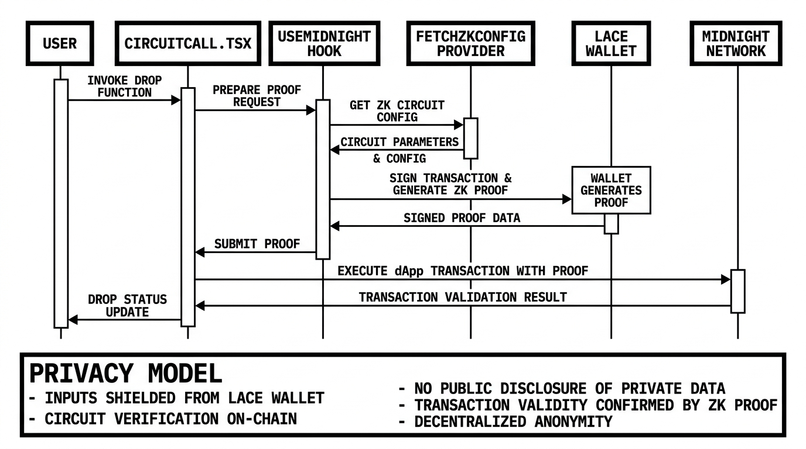

# midnight-shot

> A cryptographic whistleblower disclosure platform powered by zero-knowledge proofs on the Midnight Network.

## Live Demo

🔗 **[https://midnight-shot.vercel.app/](https://midnight-shot.vercel.app/)**

## Contract Address

| Network | Address |
|---------|---------|
| Preprod | `1e773bbc8d2e7a6af104d1ade8f3a2bd32fb4d5b2cc507c5f38ca43dfe861751` |

## What This Does

Midnight Drop is a decentralized application that lets users submit cryptographically provable disclosures — document hashes, statements, or records — to the Midnight Preprod network **without ever revealing the underlying data**. The zero-knowledge proof is compiled and generated entirely inside the browser using the Midnight.js SDK, then submitted on-chain via the `storeMessage` circuit. An on-chain observer can verify the proof was valid, but cannot reconstruct the original input.

## Privacy Model

**What is PUBLIC:**
- The fact that a valid disclosure was submitted to the Midnight Preprod contract
- The on-chain ledger `message` state hash
- The circuit identifier (`storeMessage`) and proof verification status

**What is PRIVATE:**
- The user's raw input text / disclosure content
- The user's organizational credential or identity
- The raw document content prior to hashing

**What the user PROVES without revealing:**
- That they possess a valid input satisfying the `storeMessage` circuit constraint
- Without exposing that input to any on-chain observer, indexer, or third party

## Privacy Claim

An on-chain observer can see that the `storeMessage` circuit was executed and a valid zero-knowledge proof was verified against the Preprod contract at address `1e773bbc8d2e7a6af104d1ade8f3a2bd32fb4d5b2cc507c5f38ca43dfe861751`. However, it is **mathematically impossible** for any observer to reconstruct the original private input or link the submission to a specific real-world identity from the ledger state alone. The raw message never leaves the user's browser.

## Tech Stack

Midnight Network · Compact (v0.16.0) · Midnight.js SDK · React · Next.js App Router · Lace Wallet · Vercel

## Prerequisites

- **Lace Wallet** — Browser extension installed and configured for the **Preprod** network
- **Unshielded Address** — An active unshielded account address within your Lace wallet
- **tNIGHT Tokens** — Testnet funds for gas fees (from the [Midnight Preprod Faucet](https://faucet.preprod.midnight.network/))
- **Node.js** — v22+

## Run Locally

### 1. Clone the Repository
```bash
git clone https://github.com/akxh5/midnight-shot.git
cd midnight-shot
```

### 2. Install Dependencies
```bash
npm install
```

### 3. Run Development Server
```bash
npm run dev
```

Open [http://localhost:3000](http://localhost:3000) in your browser.

### 4. Build for Production
```bash
npm run build
```

## Deploy to Vercel

```bash
# Install Vercel CLI (if not already installed)
npm install -g vercel

# Login to Vercel
vercel login

# Deploy preview
vercel

# Deploy to production
vercel --prod
```

The `vercel.json` in the repository root configures route rewrites so that `/managed/` ZK artifacts are served correctly alongside the Next.js routes.

## Architecture

### System Architecture Diagram



### Cryptographic ZK Proof Data Flow



## File Structure

```
midnight-shot/
├── contracts/
│   └── hello-world/           ← Compact smart contract
├── src/
│   ├── components/
│   │   ├── WalletConnect.tsx  ← Wallet connect/disconnect UI
│   │   └── CircuitCall.tsx    ← Circuit call button + result display
│   ├── hooks/
│   │   └── useMidnight.ts     ← Midnight.js SDK hook (state machine)
│   ├── App.tsx
│   └── app/
├── public/                    ← Architecture diagrams
├── tests/
├── vercel.json
├── next.config.js
└── README.md
```

## Demo Video

[PLACEHOLDER — I will add the link after recording]
