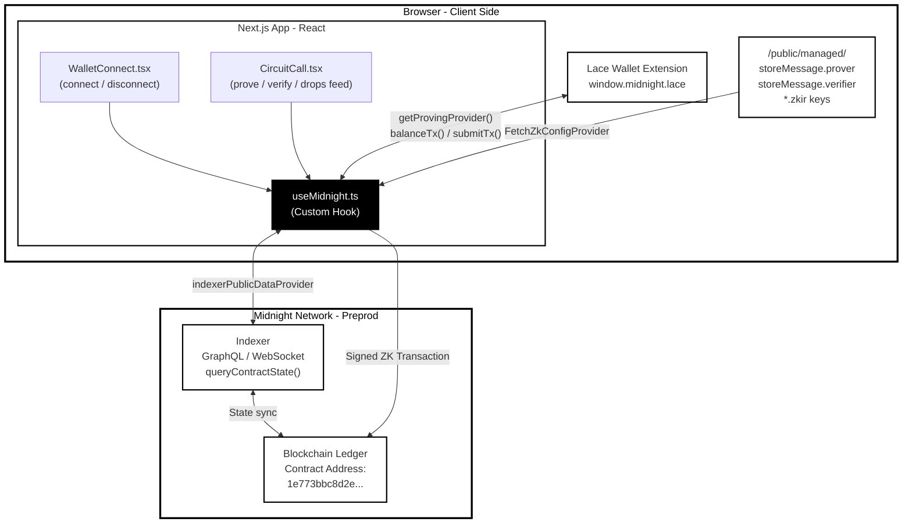
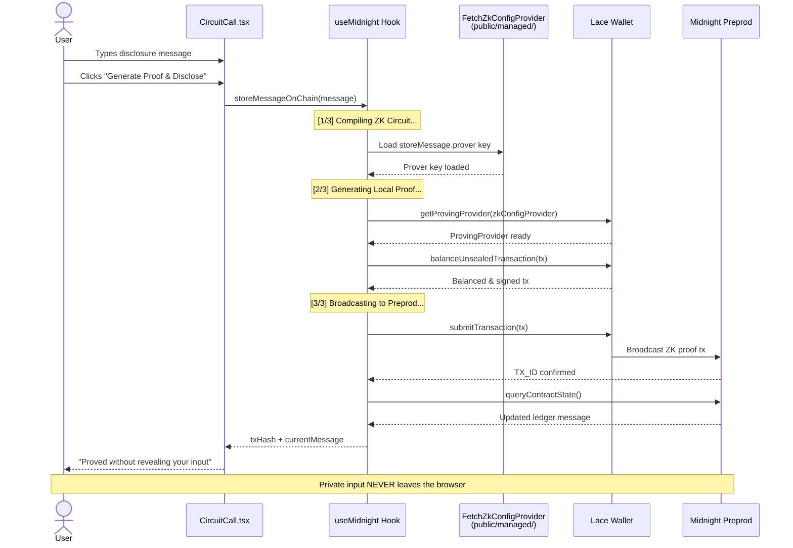

# Midnight Drop

> A cryptographic whistleblower disclosure platform powered by zero-knowledge proofs on the Midnight Network.

## Live Demo

🔗 **[https://midnight-shot.vercel.app/](https://midnight-shot.vercel.app/)**

## Contract Address

| Network  | Address                                                              |
|----------|----------------------------------------------------------------------|
| Preprod  | `1e773bbc8d2e7a6af104d1ade8f3a2bd32fb4d5b2cc507c5f38ca43dfe861751` |

## What This Does

Midnight Drop is a decentralized application that lets users submit cryptographically provable disclosures (document hashes, statements, or records) to the Midnight Preprod network without revealing the underlying data. The zero-knowledge proof is generated entirely inside the browser and verified on-chain via the `storeMessage` circuit.

## Architecture



### ZK Proof Data Flow




## Privacy Model

- **What is PUBLIC:** The fact that a valid disclosure was submitted; the on-chain ledger `message` state.
- **What is PRIVATE:** The user's raw private input, their organizational credential, and the raw document content.
- **What the user PROVES without revealing:** That they possess a valid input satisfying the circuit constraint, without exposing that input to any observer.

## Privacy Claim

An on-chain observer can see that the `storeMessage` circuit was executed and a valid proof was verified. However, it is mathematically impossible for any observer to reconstruct the original private input or link the submission to a specific real-world identity from the ledger state alone.

## Tech Stack

Midnight Network, Compact (v0.16.0), Midnight.js SDK, React, Next.js App Router, Tailwind CSS v4, Lace Wallet, Vercel

## Prerequisites

- [Lace Wallet](https://www.lace.io/) browser extension installed and configured on **Preprod** network
- Node.js v22+

## Run Locally

### 1. Clone the Repository
```bash
git clone https://github.com/akxh5/midnight-shot.git
cd midnight-shot
```

### 2. Install Dependencies
```bash
npm install
```

### 3. Run Development Server
```bash
npm run dev
```

### 4. Build for Production
```bash
npm run build
```

## Deploy to Vercel

```bash
# Install Vercel CLI (if not already installed)
npm install -g vercel

# Login to Vercel
vercel login

# Deploy preview
vercel

# Deploy to production
vercel --prod
```

The `vercel.json` in the repository root configures route rewrites so that the `/managed/` ZK artifacts are served correctly alongside the SPA routes.

## Demo Video

[PLACEHOLDER — I will add the link after recording]
