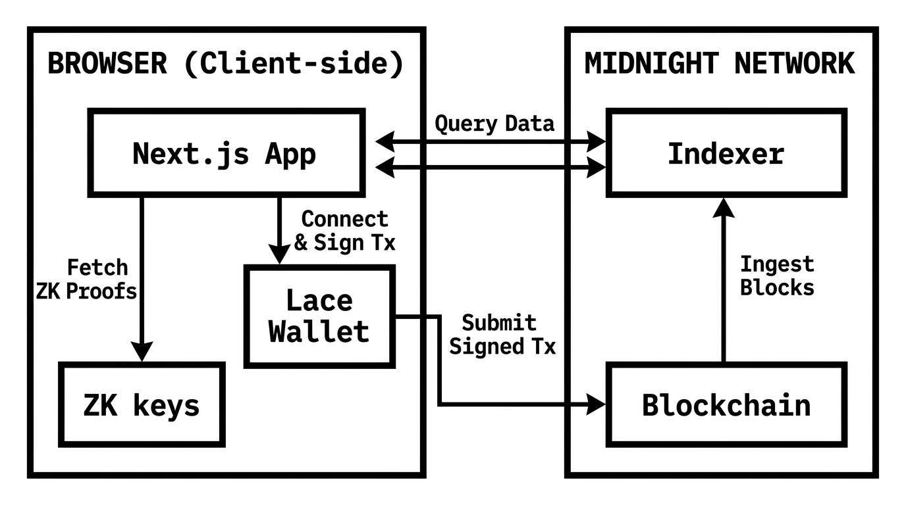
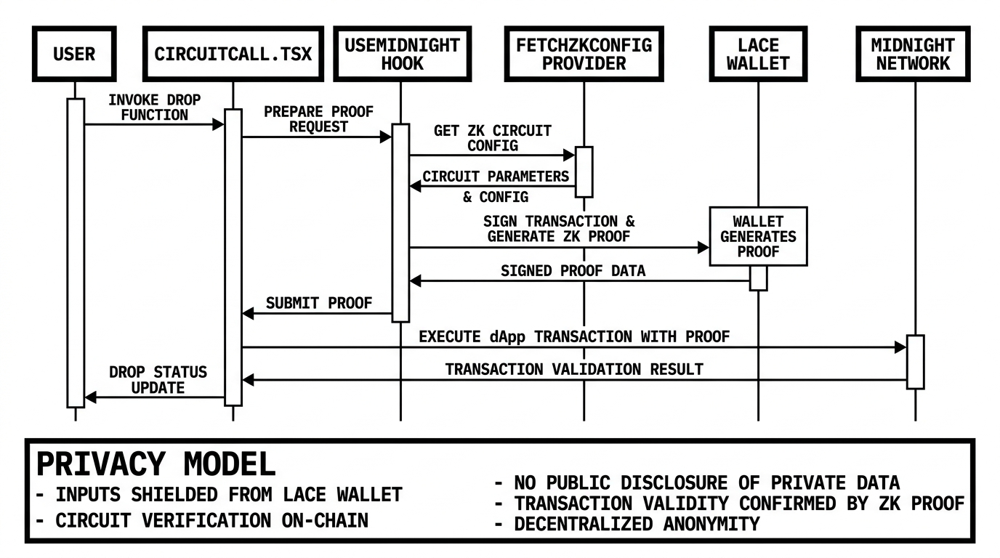

# midnight-shot

> A cryptographic whistleblower disclosure platform powered by zero-knowledge proofs on the Midnight Network.

## Live Demo

🔗 **[https://midnight-shot.vercel.app/](https://midnight-shot.vercel.app/)**

## Contract Address

| Network | Address |
|---------|---------|
| Preprod | `PENDING DEPLOYMENT — see DEPLOYMENT.md` |

This repo's `contracts/disclosure.compact` is compiled and tested (see `tests/disclosure.test.ts`), but not yet deployed to Preprod: the deploy requires a local proof server, which requires Docker, which was unavailable in the environment this rewrite was done in. `DEPLOYMENT.md` has the exact status and the command to run once Docker is available. Nothing in this README should be read as claiming a live Preprod deployment exists until this table has a real address in it.

## What This Does

Midnight Drop is a decentralized application that lets users submit cryptographically provable disclosures — statements, document hashes, or records — to the Midnight Preprod network **without ever revealing the underlying data**. Each disclosure is salted with a random 32-byte nonce, hashed in the browser, and only the resulting commitment is proved and written on-chain via the `submitDisclosure` circuit. A second circuit, `proveAuthorship`, lets the original discloser later prove they know the preimage of one of their own commitments, without revealing it. The zero-knowledge proofs are compiled and generated entirely inside the browser using the Midnight.js SDK.

## Privacy Model

**What is PUBLIC (on-chain, in `contracts/disclosure.compact`):**
- `commitments: Set<Bytes<32>>` — the set of all commitments ever submitted. Each entry is `persistentHash(domain, H(message || nonce))` — a hash of a hash, never the message itself and never a bare hash of the message alone (which would be brute-forceable by hashing guessed messages).
- `disclosureCount: Counter` — how many `submitDisclosure` calls have ever succeeded.
- The fact that a valid disclosure or authorship proof was submitted, and that the ZK proof verified.

**What is PRIVATE (never on-chain, never returned to any caller):**
- The raw disclosure message.
- The random 32-byte nonce and the intermediate salted hash H(message || nonce) — both live only in this browser's encrypted private state (via the Midnight private state provider), never in `localStorage`, never on-chain.
- The user's identity, beyond whatever their wallet address already reveals by submitting a transaction.

**What two circuits prove, and what each one discloses:**
- `submitDisclosure()` — reads the private witness, salts and hashes it, and discloses *only the resulting commitment* before writing it to `commitments` and incrementing `disclosureCount`. `disclose()` is never applied to the raw witness value — only to the derived commitment, at the point it's written or checked against the ledger (the Compact compiler requires this even for the read-only membership check in `proveAuthorship`, since checking membership necessarily reveals which commitment is being checked).
- `proveAuthorship()` — recomputes the same commitment from the same private witness and proves it's already a member of `commitments`, returning only a Boolean. **Calling this discloses which commitment the caller is claiming — and doing so from a connected wallet links that specific commitment to that wallet address.** It's a deliberate, opt-in re-identification: proof of authorship is only useful when the prover intends to be recognized as the author of that specific disclosure (e.g. taking credit, or responding to a challenge), and nothing about the original message is revealed by it.

**A statistical note on `disclosureCount` vs. `commitments.size()`:** `commitments` is a `Set` — inserting a commitment that's already present is a no-op for the set's membership, but `disclosureCount` still increments on every `submitDisclosure` call regardless. If `disclosureCount` is ever observed to exceed `commitments.size()`, that means the same salted secret was submitted more than once — i.e. duplicate disclosures happened. This is a real, observable public signal: it doesn't reveal *which* disclosures were duplicated or their content, but it does reveal that duplication occurred at all.

## Privacy Claim

An on-chain observer can see that `submitDisclosure` or `proveAuthorship` executed against the Preprod contract and that the proof verified. They can read every commitment in `commitments` and the current `disclosureCount`. They cannot recover the original disclosure message from a commitment — it is a domain-separated hash of a nonce-salted hash, not a bare hash of the message, so it cannot be brute-forced by hashing guessed messages either. They also cannot link a submission to a wallet address unless that wallet later calls `proveAuthorship` on that specific commitment, which is an intentional, opt-in disclosure of authorship — not something `submitDisclosure` does on its own.

## Tech Stack

Midnight Network · Compact language 0.23.0 (compiler 0.31.1) · Midnight.js SDK · React · Next.js App Router · Lace Wallet · Vercel

## Prerequisites

- **Lace Wallet** — Browser extension installed and configured for the **Preprod** network
- **Unshielded Address** — An active unshielded account address within your Lace wallet
- **tNIGHT Tokens** — Testnet funds for gas fees (from the [Midnight Preprod Faucet](https://faucet.preprod.midnight.network/))
- **Node.js** — v22+
- **Docker** — required locally only if you intend to deploy or run the CLI scripts (proof server); not required to browse the deployed site once it exists

## Run Locally

### 1. Clone the Repository
```bash
git clone https://github.com/akxh5/midnight-shot.git
cd midnight-shot
```

### 2. Install Dependencies
```bash
npm install
```

### 3. Run Development Server
```bash
npm run dev
```

Open [http://localhost:3000](http://localhost:3000) in your browser.

### 4. Build for Production
```bash
npm run build
```

## Deploy to Vercel

```bash
# Install Vercel CLI (if not already installed)
npm install -g vercel

# Login to Vercel
vercel login

# Deploy preview
vercel

# Deploy to production
vercel --prod
```

The `vercel.json` in the repository root configures route rewrites so that `/managed/` ZK artifacts are served correctly alongside the Next.js routes.

## Architecture

### System Architecture Diagram



### Cryptographic ZK Proof Data Flow



## File Structure

```
midnight-shot/
├── contracts/
│   ├── disclosure.compact        ← Level 2 privacy contract (live)
│   └── managed/disclosure/       ← compiled output (ledger TS, zkir, keys)
├── examples/
│   └── hello-world/              ← Level 1 contract, kept for history only —
│                                    not deployed, not referenced by the live app
├── src/
│   ├── components/
│   │   ├── WalletConnect.tsx     ← Wallet connect/disconnect UI
│   │   └── CircuitCall.tsx       ← Disclosure submission + ledger read + proveAuthorship UI
│   ├── hooks/
│   │   └── useMidnight.ts        ← Midnight.js SDK hook (state machine)
│   ├── disclosure-witnesses.ts   ← salted-commitment witness provider
│   ├── deploy.ts / cli.ts        ← Node-side deploy/CLI scripts
│   ├── App.tsx
│   └── app/
├── public/
│   ├── managed/disclosure/       ← ZK artifacts served to the browser at runtime
│   └── *.jpg                     ← architecture diagrams
├── tests/
│   └── disclosure.test.ts        ← runs the compiled contract via compact-runtime
├── vercel.json
├── next.config.js
└── README.md
```

## Demo Video

[PLACEHOLDER — I will add the link after recording]
